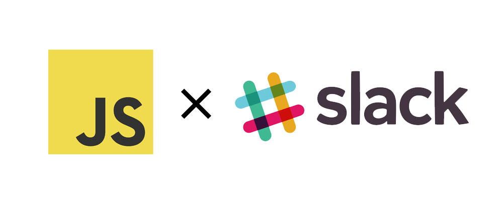

### Running the slack-bot

        # clone this repo to your local machine
        $ git clone https://github.com/mussaimo/slackbot-express.git

        # enter the folder and install dependancies
        $ cd slackbot-express
        $ npm install

        # run the main file
        $ node app
